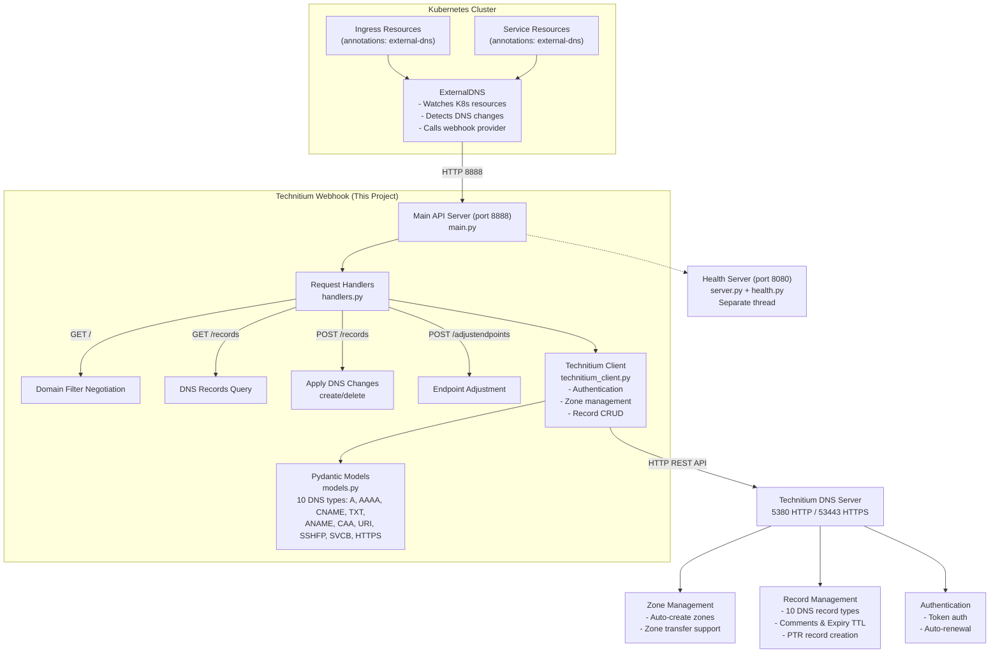
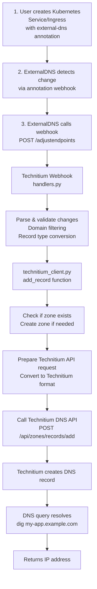
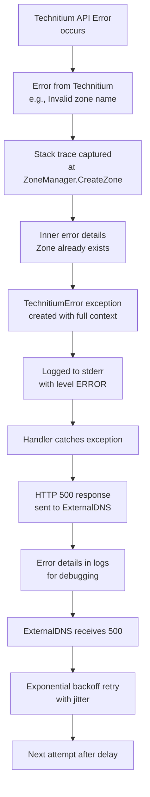
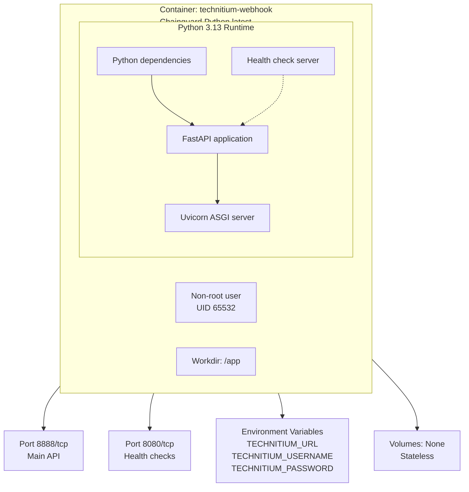
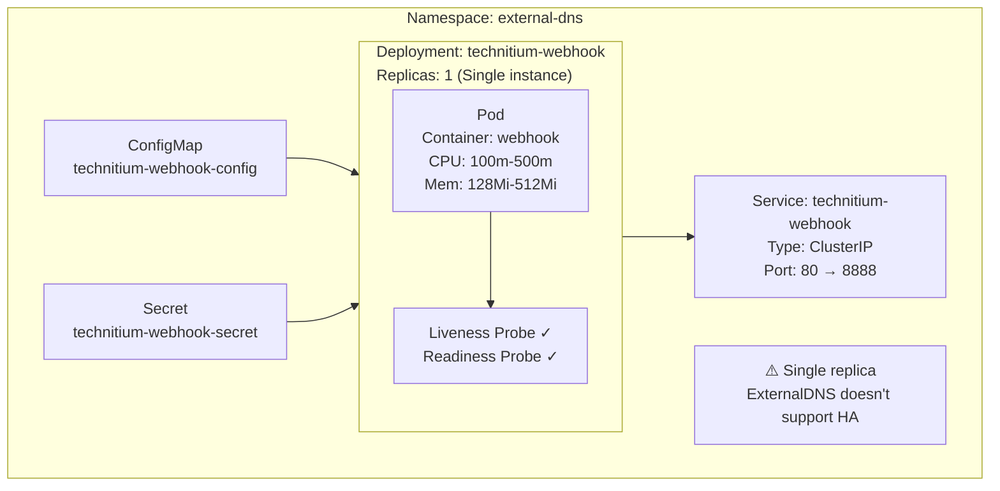
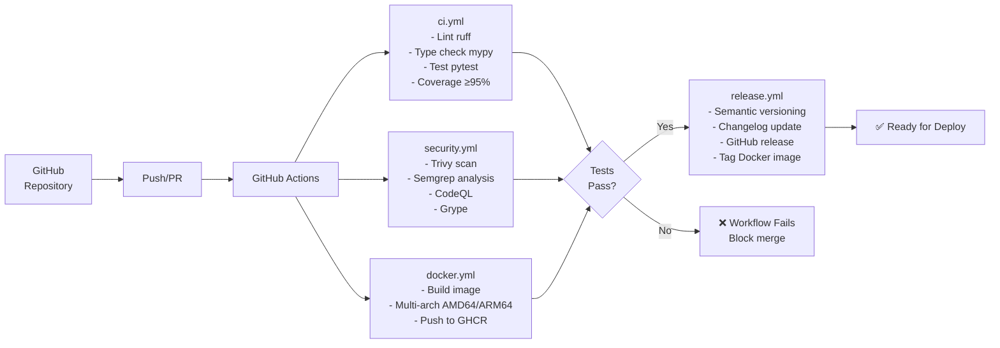
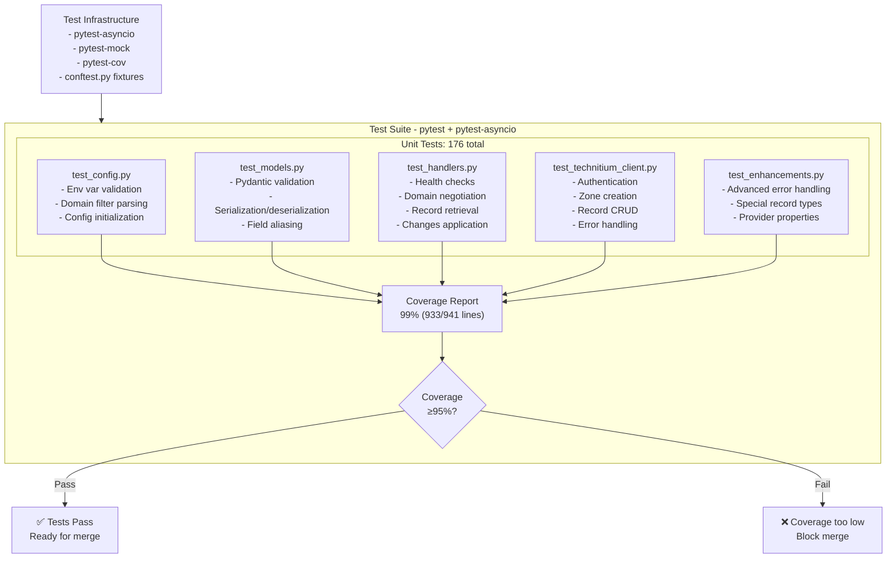
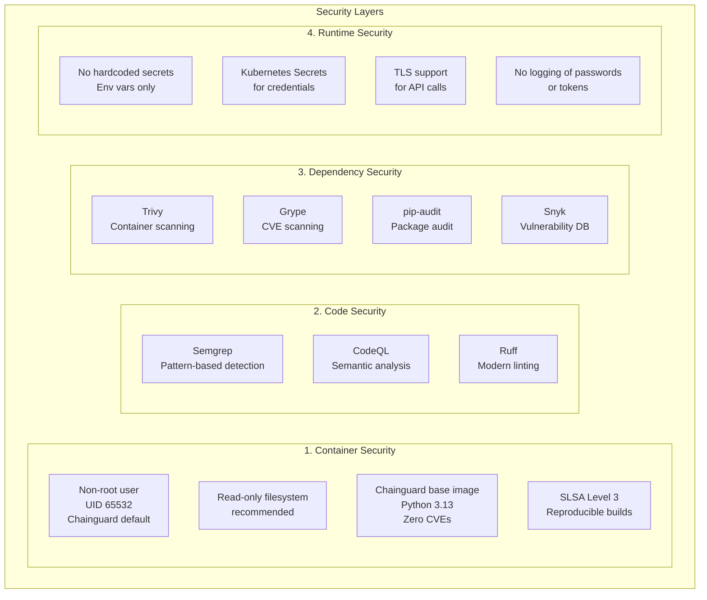

# Project Architecture

This document provides a visual overview of the external-dns-technitium-webhook architecture and component interactions.

## System Architecture



## Component Breakdown

### 1. ExternalDNS (External Component)
**Purpose:** Kubernetes controller that synchronizes DNS records with DNS providers

**Responsibilities:**
- Watch Kubernetes resources (Services, Ingresses)
- Detect DNS annotation changes
- Call webhook provider endpoints
- Reconcile DNS state

**Configuration:**
```yaml
args:
  - --source=service
  - --source=ingress
  - --provider=webhook
  - --webhook-provider-url=http://technitium-webhook
```

### 2. Technitium Webhook (This Project)
**Purpose:** Translate ExternalDNS webhook calls to Technitium DNS API calls

**Components:**

#### 2.1 FastAPI Application (`main.py`)
- HTTP server on port 8888
- 4 webhook endpoints
- Health check endpoints
- CORS support
- Async request handling

#### 2.2 Request Handlers (`handlers.py`)
**Functions:**
- `health_check()` - Health and readiness checks
- `negotiate()` - Domain filter negotiation
- `get_records()` - Retrieve DNS records
- `adjust_endpoints()` - Apply DNS changes

**Features:**
- Domain filtering (include/exclude/regex)
- Record type conversion (10 types)
- Change detection (create/delete/update)
- Error propagation

#### 2.3 Technitium Client (`technitium_client.py`)
**API Operations:**
- `login()` - Authenticate and get token
- `create_zone()` - Auto-create zones
- `get_records()` - Fetch zone records
- `add_record()` - Create DNS records (with 8 advanced options)
- `delete_record()` - Remove DNS records

**Enhanced Features:**
- Automatic token renewal
- Structured error handling (TechnitiumError)
- Stack trace capture
- Advanced options support

#### 2.4 Data Models (`models.py`)
**Pydantic Models:**

**ExternalDNS Format:**
- `Endpoint` - DNS record in ExternalDNS format
- `Changes` - Create/delete change sets
- `DomainFilter` - Domain filtering rules

**Technitium Format:**
- `RecordAData` - A record (IPv4)
- `RecordAAAAData` - AAAA record (IPv6)
- `RecordCNAMEData` - CNAME record
- `RecordTXTData` - TXT record
- `RecordANAMEData` - ANAME record (Technitium proprietary)
- `RecordCAAData` - CAA record (Let's Encrypt)
- `RecordURIData` - URI record
- `RecordSSHFPData` - SSHFP record
- `RecordSVCBData` - SVCB/HTTPS record

#### 2.5 Configuration (`config.py`)
**Environment Variables:**
- `TECHNITIUM_API_URL` - DNS server URL
- `TECHNITIUM_API_TOKEN` - Authentication token
- `DOMAIN_FILTER` - Domain filtering
- `LISTEN_ADDRESS` - Bind address
- `LOG_LEVEL` - Logging verbosity

#### 2.6 Application State (`app_state.py`)
**Shared State:**
- Technitium client instance
- Configuration singleton
- Ready state flag

### 3. Technitium DNS Server (External Component)
**Purpose:** Authoritative DNS server with REST API

**API Endpoints Used:**
- `POST /api/user/login` - Authentication
- `POST /api/zones/create` - Zone creation
- `GET /api/zones/records/get` - Record retrieval
- `GET /api/zones/records/add` - Record creation
- `GET /api/zones/records/delete` - Record deletion

## Data Flow

### Record Creation Flow



### Error Handling Flow



## Deployment Architecture

### Docker Container

### Docker Container



### Kubernetes Deployment



## CI/CD Pipeline



## Testing Architecture



## Security Architecture



## Scalability Considerations

### Deployment Model
- ⚠️ **Single Instance Only:** ExternalDNS controller doesn't support HA deployments
- ✅ **Stateless Design:** Webhook is stateless and could theoretically scale if ExternalDNS supported it
- ✅ **Health Checks:** Liveness and readiness probes for pod restart on failure

### Performance Optimization
- ✅ **Async I/O:** Non-blocking operations
- ✅ **Connection pooling:** Reuse HTTP connections to Technitium
- ✅ **Graceful shutdown:** Drains in-flight requests on pod termination
- ✅ **Fast startup:** < 1 second initialization

### Resource Efficiency
- ✅ **Low memory:** ~64Mi base footprint
- ✅ **Low CPU:** 100m-500m per pod
- ✅ **Small image:** ~200MB container image
- ✅ **Multi-arch:** AMD64 and ARM64 support

## Monitoring and Observability

### Current Implementation
```
┌────────────────────────────────────────────────────┐
│     Application Logging                            │
│                                                    │
│  - Structured logs (External-DNS format)          │
│    time="..." level=... module=... msg="..."      │
│  - Log levels (DEBUG through ERROR)                │
│  - Request/response logging                        │
│  - Error stack traces                              │
└────────────────────────────────────────────────────┘
```

### Health Checks

**Main API Server (port 8888):**
- `GET /` → Negotiates domain filters (returns ExternalDNS webhook response)
- `GET /records` → Fetches current DNS records
- HTTP 200 OK if app is ready, HTTP 503 if not ready or Technitium unreachable

**Health Check Server (port 8080):**
- `GET /health` → Returns `{"status": "ok"}` on 200, or 503 with error on failure
- `GET /healthz` → Kubernetes-style readiness probe, returns `{"status": "ok"}` on 200, or 503 with error
- Checks if main server socket is responding (liveness/readiness validation)
- Runs on separate thread to isolate from main API load

### Future Enhancements
```
┌────────────────────────────────────┐
│    Prometheus Metrics (Future)     │
│                                    │
│  - Request count                  │
│  - Request duration               │
│  - Error rate                     │
│  - Technitium API latency         │
│  - Record operations              │
└────────────────────────────────────┘

┌────────────────────────────────────┐
│  OpenTelemetry Tracing (Future)    │
│                                    │
│  - Request tracing                │
│  - Span creation                  │
│  - Distributed tracing            │
│  - Performance analysis           │
└────────────────────────────────────┘
```

## Summary

This architecture provides:

1. ✅ **Separation of Concerns** - Clear component boundaries
2. ✅ **Scalability** - Horizontal scaling ready
3. ✅ **Security** - Multiple security layers
4. ✅ **Testability** - Comprehensive test suite
5. ✅ **Observability** - Logging and health checks
6. ✅ **Maintainability** - Clean code structure
7. ✅ **Extensibility** - Easy to add new record types
8. ✅ **Production Ready** - All best practices followed

For detailed implementation guides, see:
- [API Reference](../API.md)
- [Development Guide](../DEVELOPMENT.md)
- [Kubernetes Deployment](../deployment/kubernetes.md)
- [Contributing Guidelines](../CONTRIBUTING.md)
- [Monitoring & Observability](../MONITORING.md)
- [Performance Tuning](../PERFORMANCE.md)
